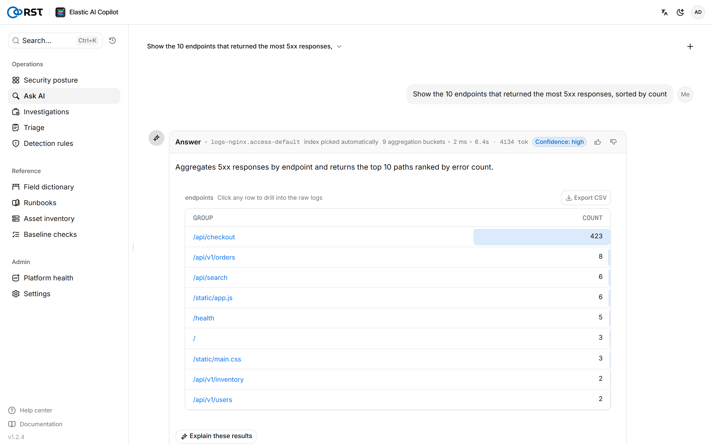
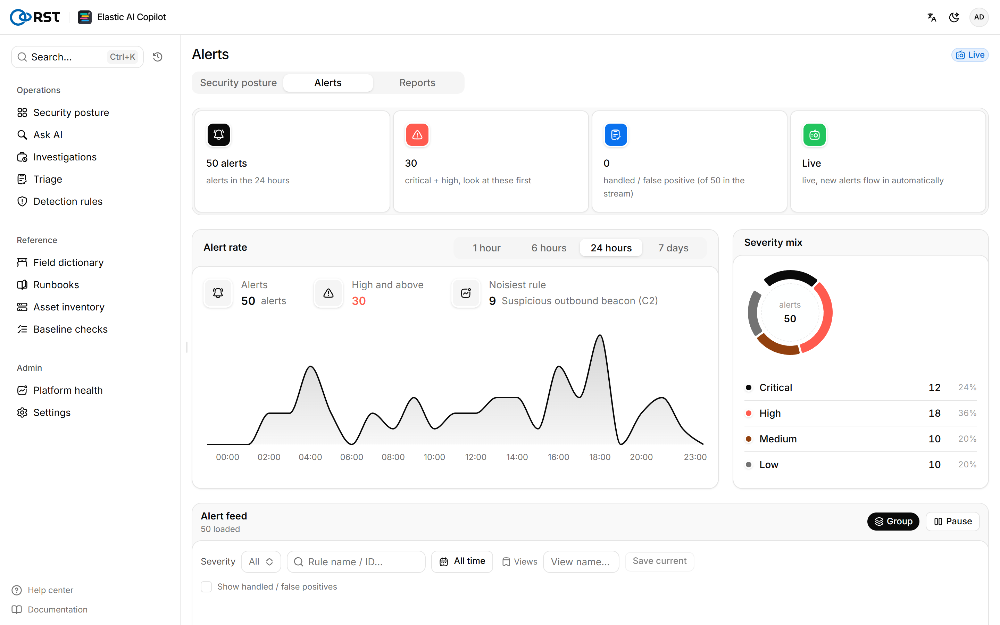
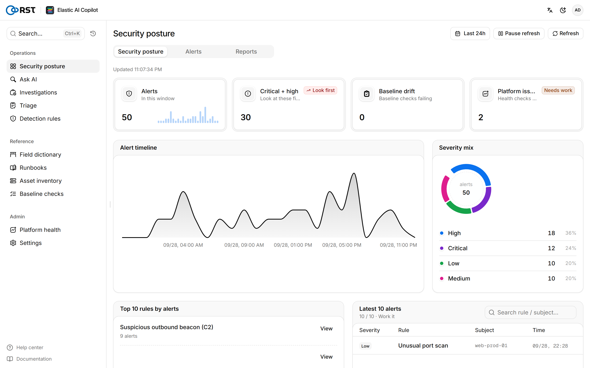
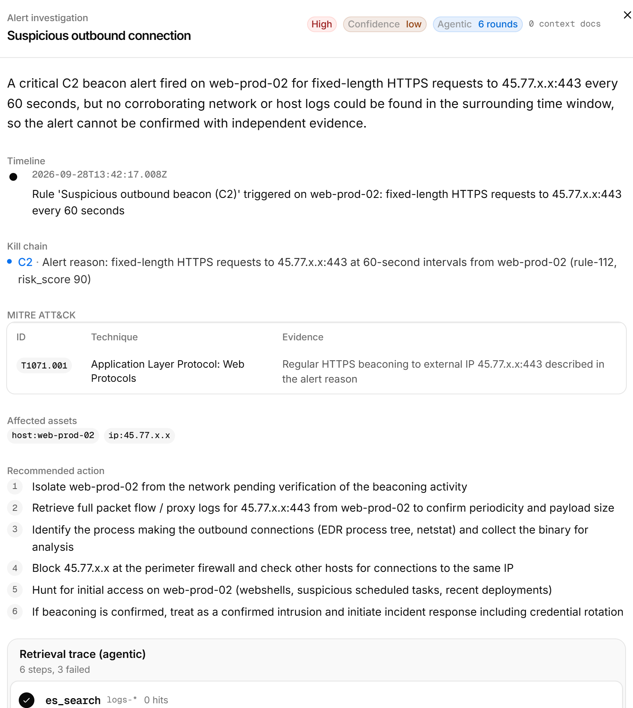
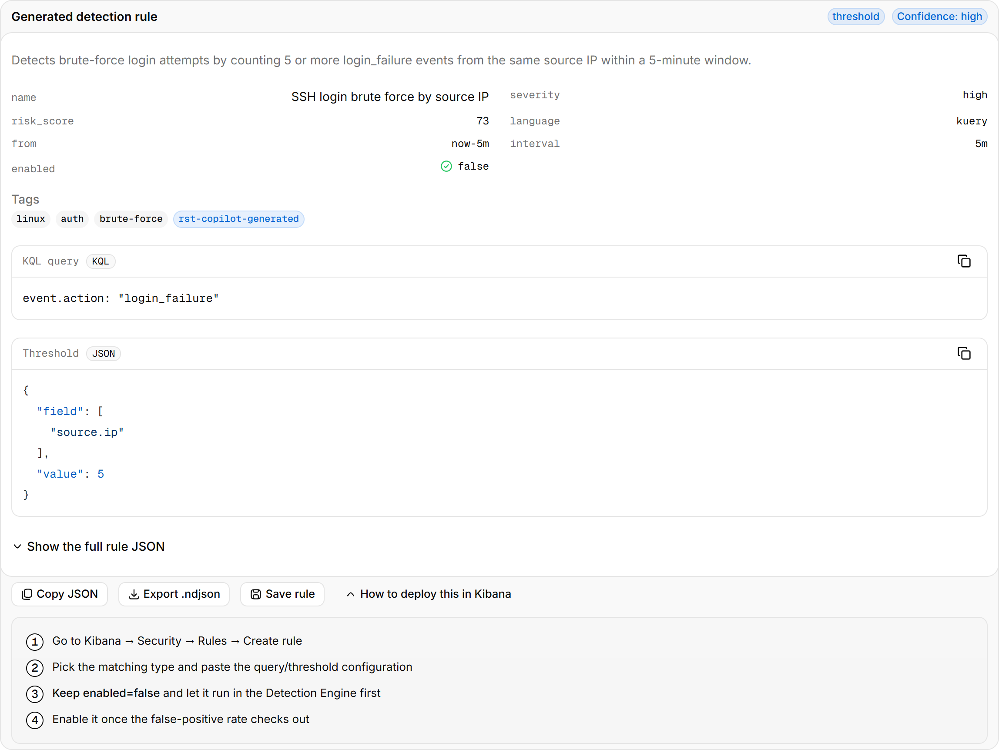
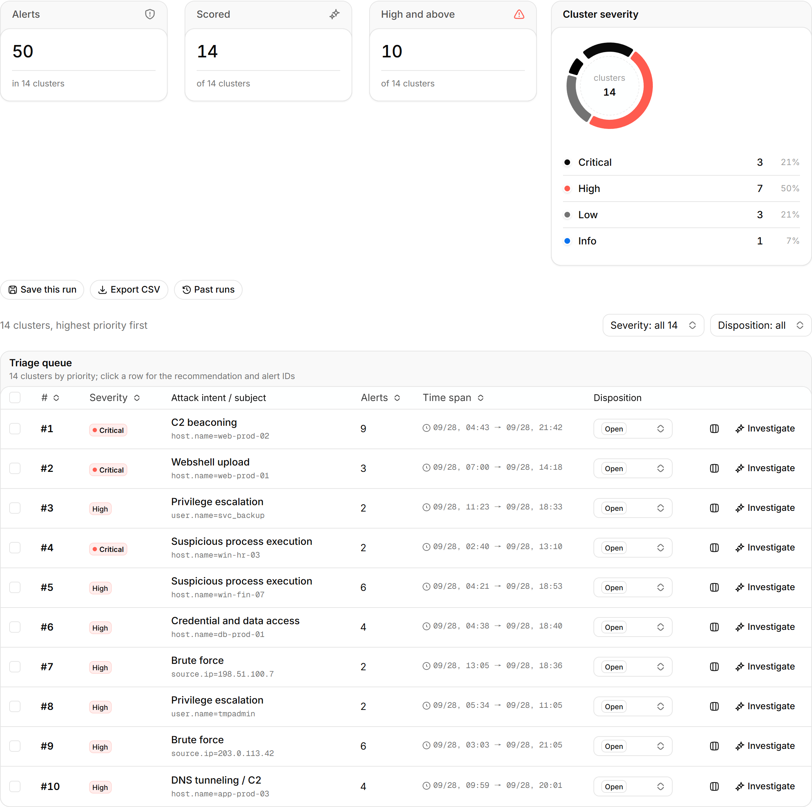
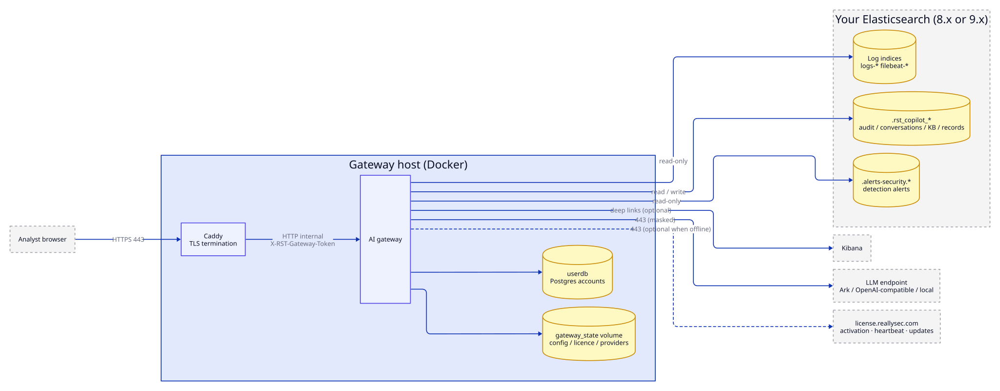

<p align="center">
  
</p>

<h1 align="center">RST Elastic AI Copilot</h1>

<p align="center">
  <b>Ask your Elastic logs in plain language.</b><br>
  A self-hosted AI copilot for security operations on the Elasticsearch and Kibana you already run:<br>
  search, alert triage and investigation, detection rules. Read-only, air-gap ready, every model call audited.
</p>

<p align="center">
  <a href="https://github.com/reallysec/RST-Elastic-AI-Copilot/releases"></a>
  
  
  
  <a href="https://reallysec.com/en/docs/elastic-ai-copilot"></a>
</p>

<p align="center">
  <b>English</b> · <a href="README.zh-CN.md">简体中文</a> · <a href="https://reallysec.com/en/docs/elastic-ai-copilot">Docs</a> · <a href="https://github.com/reallysec/RST-Elastic-AI-Copilot/releases">Download</a> · <a href="https://github.com/reallysec/RST-Elastic-AI-Copilot/issues">Report an issue</a>
</p>

<p align="center">
  
</p>

## Why RST Elastic AI Copilot

- **Works with the stack you have.** One Docker gateway next to your existing Elasticsearch and Kibana. No new data store, no agents; it reads your logs and security alerts where they already are.
- **Read-only by design.** Every generated query is validated as read-only before it runs. The gateway writes only its own `.rst_copilot_*` indices, and an index whitelist bounds what the model may query.
- **Your data stays in your network.** Field masking runs before anything reaches the model. Point it at Volcengine Ark, any OpenAI-compatible endpoint, or a local vLLM / Ollama for fully air-gapped operation.
- **Every step is accountable.** Each login, query, model call and settings change is an audit event you can search.

## Quick start

You need a Linux host with Docker Engine 24+ and Compose v2, network access to Elasticsearch 8.x or 9.x, an OpenAI-compatible LLM endpoint, and a hostname for the analysts ([full requirements](https://reallysec.com/en/docs/elastic-ai-copilot/install/requirements)).

Install with one command:

```bash
curl -fsSL https://github.com/reallysec/RST-Elastic-AI-Copilot/releases/latest/download/install.sh | sudo bash
```

The script downloads the latest bundle, checks its SHA-256, unpacks it into `/opt/rst-elastic-ai-copilot` and runs `deploy.sh`. There is one bundle for every edition: without a licence it runs as the free Community Edition, and importing a licence under **Settings → License** unlocks Professional or Enterprise in place. On an air-gapped host, run it elsewhere with `--download-only` and carry the bundle over.

Or download the bundle from [Releases](https://github.com/reallysec/RST-Elastic-AI-Copilot/releases) yourself:

```bash
sha256sum -c RST-Elastic-AI-Copilot-<version>.tar.gz.sha256
tar xzf RST-Elastic-AI-Copilot-<version>.tar.gz
cd RST-Elastic-AI-Copilot-<version> && ./deploy.sh
```

`deploy.sh` loads the images, generates secrets and the host fingerprint, asks for the LLM and Elasticsearch endpoints, and starts the stack behind Caddy TLS. About two minutes later, open `https://<hostname>/v2/`.

Upgrade, rollback, backup, SSO, Elasticsearch permissions and every `.env` key: [installation docs](https://reallysec.com/en/docs/elastic-ai-copilot/install/deploy).

## Features

Everything below is in the free Community Edition (one user, one node, no model-call limit; you bring your own model).

- **Smart query**: natural language to Elasticsearch DSL, read-only validation, dry run, aggregation and hit tables, multi-turn follow-ups.
- **Empty-result diagnosis**: points out a wrong time window, a blocking clause, a wrong index or an unmatched source.
- **Live alerts**: `.alerts-security` polling or a Kibana webhook, a summary per alert, grouping and dispositions.
- **Posture**: security posture overview and a local audit trail.
- **Context for the model**: field dictionary, runbook knowledge base (RAG), asset and identity ledger, CIS / MLPS 2.0 baselines over osquery.
- **Privacy controls**: field masking (cloud / private / air-gapped) and per-task reasoning levels.
- **Notifications**: Feishu, DingTalk, WeCom, Teams, Slack and email.

<table>
  <tr>
    <td></td>
    <td></td>
  </tr>
</table>

## Professional and Enterprise

Professional unlocks four AI engines: **alert batch triage**, **alert investigation** (agentic evidence gathering, timeline, MITRE ATT&CK, incident reports), a **detection-rule copilot** (KQL / EQL / threshold rules, `.ndjson` export) and a **platform-ops copilot**, plus scheduled **operations reports** and more users (priced per user). Enterprise adds organisation-scale integration. Upgrading is a licence import on the same install: no reinstall, data and host fingerprint are kept. A 30-day trial covers every Enterprise feature on one host.

<table>
  <tr>
    <td></td>
    <td></td>
  </tr>
</table>

<details>
<summary><b>Compare editions</b></summary>

| | Community (free) | Professional | Enterprise |
|---|:---:|:---:|:---:|
| Everything under [Features](#features) | ✅ | ✅ | ✅ |
| Users | 1 | per seat | as quoted |
| **Alert batch triage**: cluster by intent and subject, model-scored severity and false-positive verdicts | — | ✅ | ✅ |
| **Alert investigation**: agentic evidence gathering, timeline, MITRE ATT&CK, affected assets, actions, incident reports | — | ✅ | ✅ |
| **Detection-rule copilot**: KQL / EQL / threshold rules with ATT&CK mapping, `.ndjson` export | — | ✅ | ✅ |
| **Platform-ops copilot**: AI read of the Elastic cluster check-up | — | ✅ | ✅ |
| **Operations reports**: daily / weekly / monthly, scheduled delivery | — | ✅ | ✅ |
| Audit forwarding to an external SIEM (syslog / webhook) | — | — | ✅ |
| Multi-provider LLM failover / high availability | — | — | ✅ |
| OIDC single sign-on / enterprise identity | — | — | ✅ |
| Offline / air-gapped licence activation | — | — | ✅ |
| Nodes | 1 | 1 | unlimited |
| Model calls | unlimited | unlimited | unlimited |

Details and pricing: [editions](https://reallysec.com/en/docs/elastic-ai-copilot/editions). Trials and licences: [console.reallysec.com](https://console.reallysec.com).

<p align="center">
  
</p>

</details>

## Architecture and data boundary

<p align="center">
  
</p>

- Ingress: the analyst browser on 443 only. Egress: the LLM endpoint, your Elasticsearch / Kibana, and `license.reallysec.com` (not needed with an offline licence, Enterprise).
- Read-only on your indices; the index whitelist bounds what the model may query.
- Field masking runs before anything reaches the model; in air-gapped mode nothing leaves the network.
- Every login, query, model call and settings change is an audit event (`.rst_copilot_audit`), forwardable to an external SIEM in the Enterprise edition.

## Supported versions

| Component | Supported |
|---|---|
| Elasticsearch / Kibana | 8.x and 9.x, verified on 8.12 and 9.5. 7.x is not supported |
| LLM endpoint | Volcengine Ark, any OpenAI-compatible API, self-hosted vLLM / Ollama |
| Host | Linux with Docker Engine 24+ and Docker Compose v2 |

## Support

- **Questions and bugs**: open an [issue](https://github.com/reallysec/RST-Elastic-AI-Copilot/issues).
- **Security vulnerabilities**: do not open a public issue; follow the [security policy](https://github.com/reallysec/RST-Elastic-AI-Copilot/security/policy).

## Licensing

RST Elastic AI Copilot is proprietary software, distributed as compiled container images under the [End User License Agreement](LICENSE), also included in every bundle as `docs/EULA.md`. The Community Edition is free to use without a licence; Professional and Enterprise are activated online or with an offline `.lic` from [console.reallysec.com](https://console.reallysec.com). "RST", "Reallysec", "斯普朗克" and the product logos are trademarks.

© Anhui Reallysec Information Technology Ltd.
