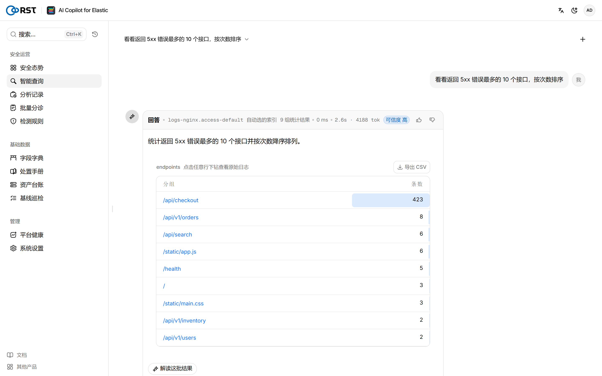
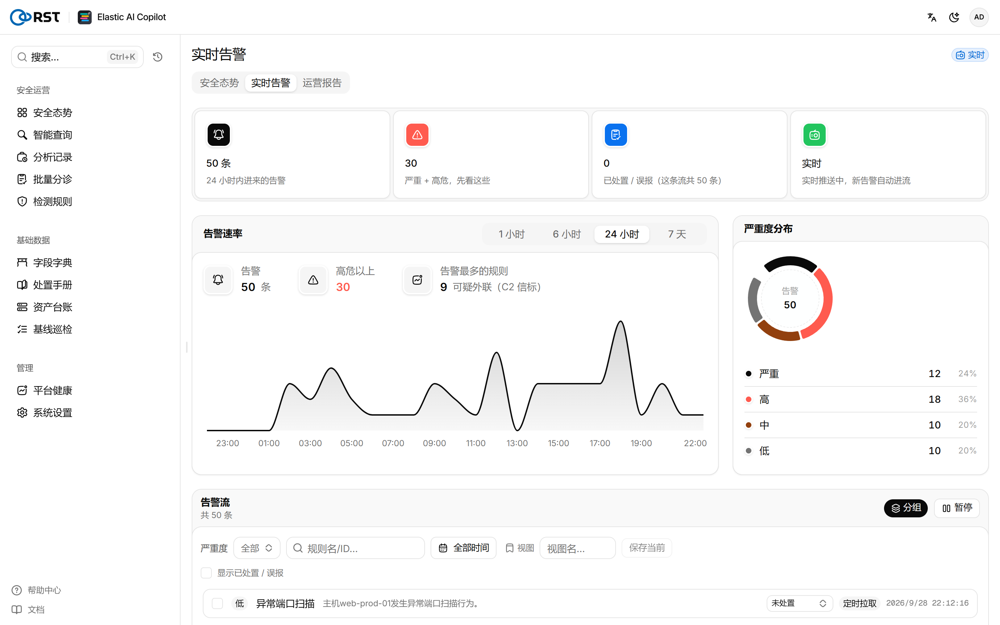
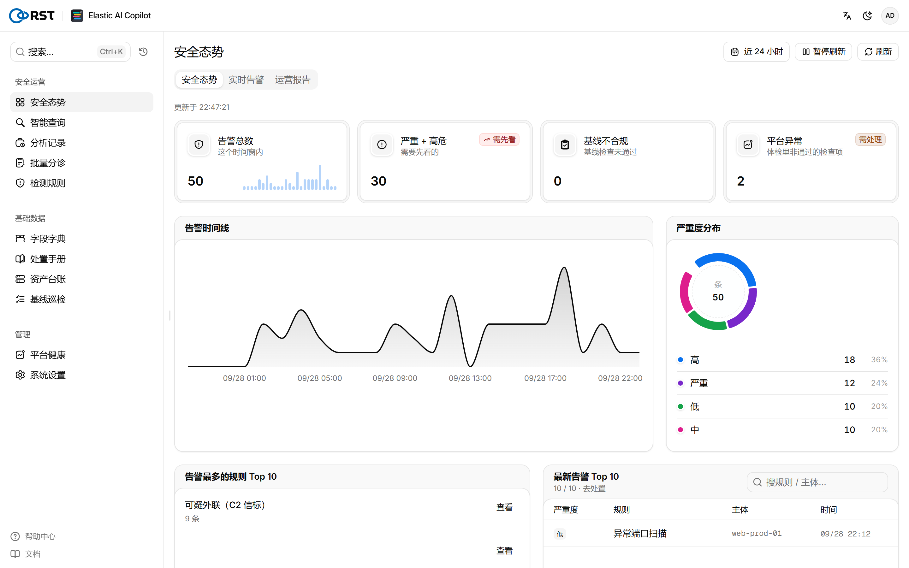
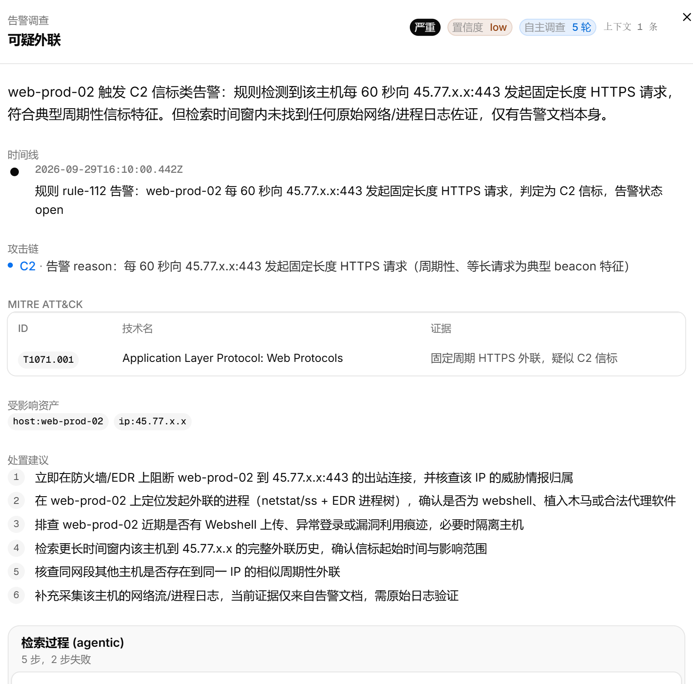
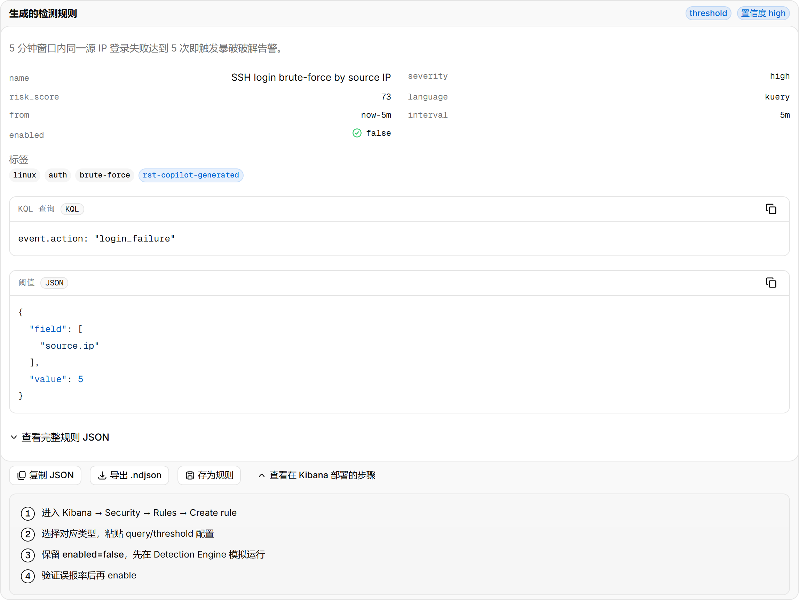
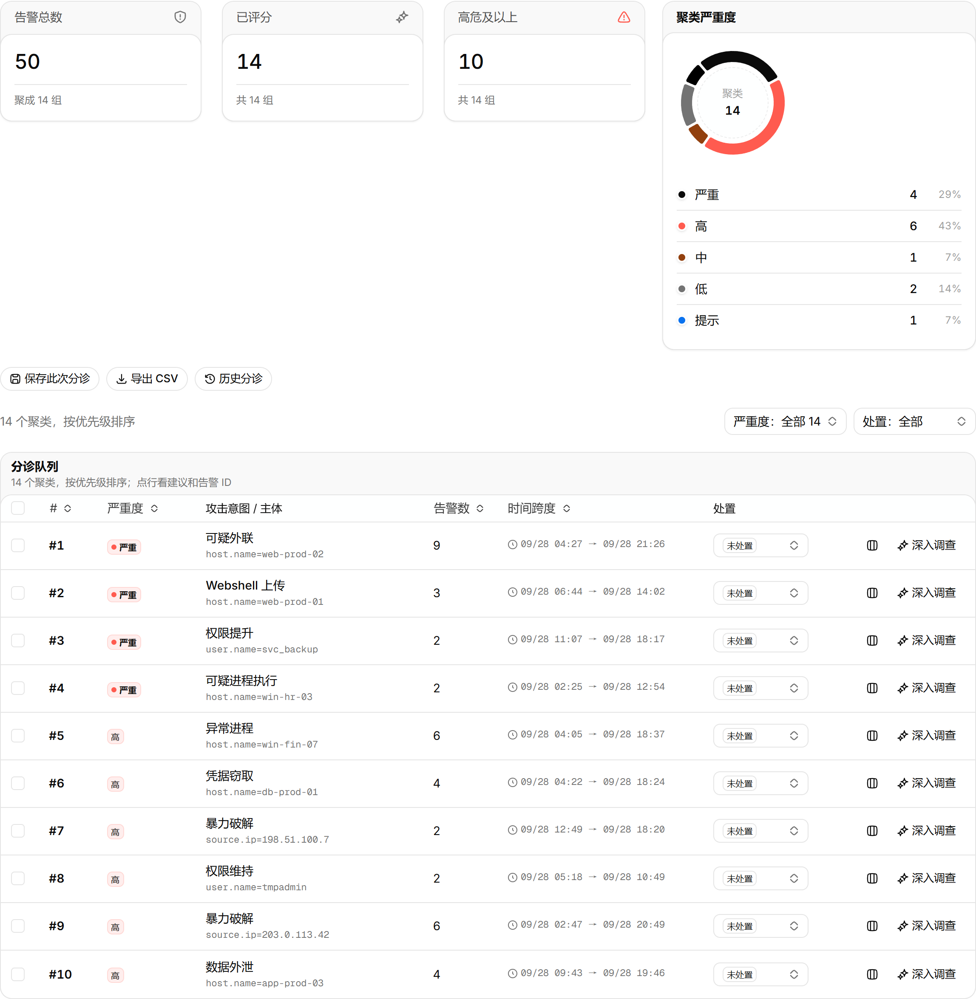
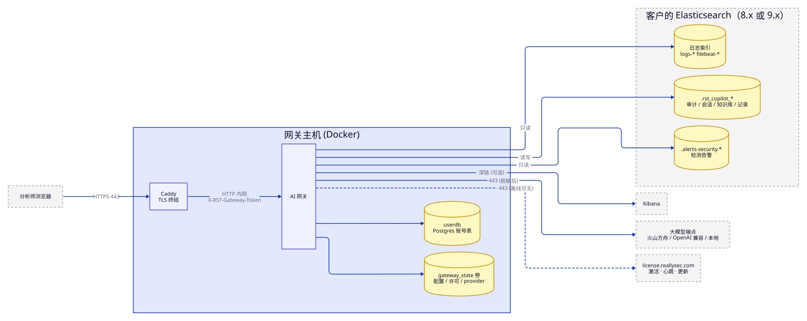

<p align="center">
  
</p>

<h1 align="center">RST AI Copilot for Elastic</h1>

<p align="center">
  <b>用自然语言问你的 Elastic 日志。</b><br>
  接在你已有的 Elasticsearch® / Kibana® 上的私有化 AI 安全运营助手：<br>
  智能查询、告警分级与调查、检测规则生成。只读、可离网部署，每一次模型调用都有审计。
</p>

<p align="center">
  <a href="https://github.com/reallysec/RST-AI-Copilot-for-Elastic/releases"></a>
  
  
  
  <a href="https://reallysec.com/docs/elastic-ai-copilot"></a>
</p>

<p align="center">
  <a href="README.md">English</a> · <b>简体中文</b> · <a href="https://reallysec.com/docs/elastic-ai-copilot">文档</a> · <a href="https://github.com/reallysec/RST-AI-Copilot-for-Elastic/releases">下载</a> · <a href="https://github.com/reallysec/RST-AI-Copilot-for-Elastic/issues">报告问题</a>
</p>

<p align="center">
  
</p>

## 为什么选 RST AI Copilot for Elastic

- **直接用你现有的 ELK。** 一个 Docker 网关，接在已有的 Elasticsearch 和 Kibana 旁边。不新建数据存储、不装采集端，日志和安全告警就在原处读取。
- **设计上只读。** 每条生成的查询在执行前都校验为只读。网关只写自己的 `.rst_copilot_*` 索引，索引白名单限定模型能查的范围。
- **数据留在你的网络里。** 字段脱敏在数据发给模型之前完成。大模型可以接火山方舟、任意 OpenAI 兼容端点，或自建 vLLM / Ollama 实现完全离网。
- **每一步都可追溯。** 每次登录、查询、模型调用、设置变更都是一条可检索的审计事件。

## 快速开始

需要一台 Linux 主机（Docker Engine 24+、Compose v2），能访问 Elasticsearch 8.x 或 9.x，一个 OpenAI 兼容的大模型端点，以及一个给分析师用的域名或 IP（[完整系统要求](https://reallysec.com/docs/elastic-ai-copilot/install/requirements)）。

一条命令安装：

```bash
curl -fsSL https://github.com/reallysec/RST-AI-Copilot-for-Elastic/releases/latest/download/install.sh | sudo bash
```

脚本下载最新的交付包，校验 SHA-256，解压到 `/opt/rst-ai-copilot-for-elastic` 后执行 `deploy.sh`。所有版本是同一个交付包：不导入许可即为免费的社区版，在侧栏「产品激活」页（`https://<地址>/v2/license`）激活许可后原地解锁专业版或企业版。离网主机可以在有网的机器上加 `--download-only` 下载，再把交付包拷过去。

也可以从 [Releases](https://github.com/reallysec/RST-AI-Copilot-for-Elastic/releases) 手动下载交付包，然后：

```bash
sha256sum -c RST-AI-Copilot-for-Elastic-<版本>.tar.gz.sha256
tar xzf RST-AI-Copilot-for-Elastic-<版本>.tar.gz
cd RST-AI-Copilot-for-Elastic-<版本> && ./deploy.sh
```

`deploy.sh` 加载镜像、生成密钥和主机指纹、询问大模型与 Elasticsearch 地址，让你设定管理员口令，然后在 Caddy TLS 后面起整个栈。约两分钟后打开 `https://<域名或 IP>/v2/`，用 `admin` 登录。

证书默认由 Caddy 内置 CA 签发，不管填的是 IP 还是域名都是自签名证书，浏览器会提示不安全，信任它的根证书即可。要用自己的证书或 Let's Encrypt，在 `.env` 里设 `CADDY_TLS`（见部署文档）。

**激活许可**（社区版跳过）：以管理员身份打开侧栏「产品激活」。在线激活：粘贴 license key，点「激活」，自动绑定本机（需出站访问 `license.reallysec.com:443`）。离线激活（企业版）：切到「离线激活」，复制主机指纹，凭它在 [console.reallysec.com](https://console.reallysec.com) 或找销售拿到 `.lic` 文件，上传后激活。

升级、回滚、备份、SSO、Elasticsearch 权限、全部 `.env` 项：[安装文档](https://reallysec.com/docs/elastic-ai-copilot/install/deploy)。

## 功能

以下能力全部包含在免费的社区版中（1 个用户、1 个节点，模型调用不限次数，模型由你自备）。

- **智能查询**：自然语言生成 Elasticsearch DSL，只读校验、试跑、聚合表 / 明细表、多轮追问。
- **结果为空的诊断**：指出时间窗不对、条件卡住、索引选错或多源未命中。
- **实时告警**：轮询 `.alerts-security` 或接 Kibana webhook，逐条摘要、分组、处置状态。
- **安全态势**：态势总览、本地审计留痕。
- **给模型的上下文**：字段字典、处置手册知识库（RAG）、资产台账、基于 osquery 的等保 2.0 / CIS 基线。
- **隐私控制**：字段脱敏三档（云端 / 私有 / 离网）、按任务分级的推理强度。
- **通知**：飞书、钉钉、企业微信、Teams、Slack、邮件。

<table>
  <tr>
    <td></td>
    <td></td>
  </tr>
</table>

## 专业版与企业版

专业版解锁四个 AI 引擎：**告警批量分级**、**告警调查**（自主取证、时间线、MITRE ATT&CK、事件报告）、**检测规则生成**（KQL / EQL / 阈值规则，导出 `.ndjson`）和**功能管理助手**，另含定时**运营报表**和多用户（按用户计费）。企业版再加组织级集成。升级只需在原安装上导入许可，不用重装，数据与主机指纹保留。试用为 14 天企业版全功能，一台主机。

<table>
  <tr>
    <td></td>
    <td></td>
  </tr>
</table>

<details>
<summary><b>版本对比</b></summary>

| | 社区版（免费） | 专业版 | 企业版 |
|---|:---:|:---:|:---:|
| [功能](#功能)一节的全部能力 | ✅ | ✅ | ✅ |
| 用户数 | 1 | 按席位 | 按报价 |
| **告警批量分级**：按意图和主体聚簇，模型评严重度、判误报 | — | ✅ | ✅ |
| **告警调查**：自主取证、时间线、MITRE ATT&CK、受影响资产、处置建议、事件报告 | — | ✅ | ✅ |
| **检测规则生成**：KQL / EQL / 阈值规则，ATT&CK 映射，导出 `.ndjson` | — | ✅ | ✅ |
| **功能管理助手**：Elastic 集群体检的 AI 解读 | — | ✅ | ✅ |
| **运营报表**：日 / 周 / 月报，定时投递 | — | ✅ | ✅ |
| 审计转发到外部 SIEM（syslog / webhook） | — | — | ✅ |
| 多 provider LLM 故障转移 / 高可用 | — | — | ✅ |
| OIDC 单点登录 / 企业身份 | — | — | ✅ |
| 离线 / 气隙许可激活 | — | — | ✅ |
| 节点数 | 1 | 1 | 不限 |
| 模型调用 | 不限 | 不限 | 不限 |

详情与价格见[版本对比](https://reallysec.com/docs/elastic-ai-copilot/editions)。试用与购买：[console.reallysec.com](https://console.reallysec.com)。

<p align="center">
  
</p>

</details>

## 架构与数据边界

<p align="center">
  
</p>

- 入站只有分析师浏览器的 443。出站：大模型端点、你的 Elasticsearch / Kibana、`license.reallysec.com`（使用离线许可时不需要，企业版）。
- 对你的索引只读；索引白名单限定模型能查的范围。
- 字段脱敏在数据发给模型之前完成；离网模式不出网。
- 每次登录、查询、模型调用、设置变更都是一条审计事件（`.rst_copilot_audit`），企业版可转发到外部 SIEM。

## 支持的版本

| 组件 | 支持情况 |
|---|---|
| Elasticsearch / Kibana | 8.x 与 9.x，在 8.12 和 9.5 上验证。不支持 7.x |
| 大模型端点 | 火山方舟、任意 OpenAI 兼容 API、自建 vLLM / Ollama |
| 主机 | Linux，Docker Engine 24+ 与 Docker Compose v2 |

## 支持

- **使用问题和缺陷**：提交 [issue](https://github.com/reallysec/RST-AI-Copilot-for-Elastic/issues)。
- **安全漏洞**：请不要公开提 issue，按[安全策略](https://github.com/reallysec/RST-AI-Copilot-for-Elastic/security/policy)报告。

## 许可

RST AI Copilot for Elastic 是专有软件，以编译后的容器镜像交付，依据[《最终用户许可协议》](LICENSE)使用（每个交付包里也附有 `docs/EULA.md`）。社区版无需许可、免费使用；专业版和企业版在 [console.reallysec.com](https://console.reallysec.com) 获取许可后在线激活或导入离线 `.lic`。「RST」「Reallysec」「斯普朗克」和产品标识是商标。

Elastic、Elasticsearch 和 Kibana 是 Elasticsearch B.V. 在美国及其他国家/地区的注册商标。RST AI Copilot for Elastic 是独立产品，与 Elasticsearch B.V. 或 Elastic N.V. 不存在隶属、认可或赞助关系；提及这些名称仅用于说明本产品所适配的平台。

© 安徽斯普朗克信息技术有限公司（Anhui Reallysec Information Technology Ltd.）
